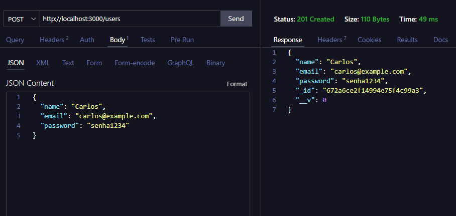
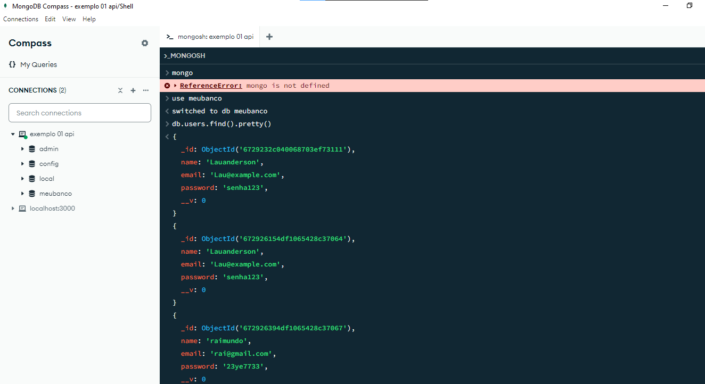

# Testando a API

### Instale as dependencias e inicialize o projeto, rodando os seguintes comandos no terminal

  npm install

  npm start

### Utilizando alguma ferramenta de testar API, como 'Postman, Insomnia ou ThunderClient'. Faça um POST para http://localhost:3000/users com o body abaixo

  {
    "name": "Carlos",
    "email": "carlos@example.com",
    "password": "senha1234"
  }

### Explorando Banco de Dados no 'MongoDB Compass'

O MongoDB Compass é uma ferramenta excelente para quem quer evitar interações por linha de comando e prefere uma interface visual para gerenciar dados MongoDB. Se você tiver mais perguntas ou precisar de ajuda com algo específico, me avise!

Ao abrir o MongoDB Compass, você verá uma tela para conectar-se ao banco de dados. A URI padrão para o MongoDB local é:
 mongodb://localhost:27017 

### Principais Funcionalidades:

<ul>
  <li>Visualizar Bancos de Dados:</li>
  <li>Visualizar e Manipular Documentos:</li>
  <li>Executar Consultas:</li>
    Você pode escrever consultas MongoDB em JSON para filtrar, ordenar e buscar documentos. Por exemplo, para buscar usuários com o nome "Lau":

    json

    { "name": "Bernardo" }

  <li>Visualizar Estatísticas do Banco de Dados:</li>
</ul>

O MongoDB Compass é uma ferramenta excelente para quem quer evitar interações por linha de comando e prefere uma interface visual para gerenciar dados MongoDB.

